# Análise de Requisitos — Libmork

## 1. Cabeçalho e Controle

| Campo | Valor |
|---|---|
| **Projeto** | Libmork — Aplicativo web de RPG de mesa |
| **Documento** | Análise de Requisitos |
| **Versão** | 0.6 |
| **Data** | 2026-08-21 |
| **Status** | Rascunho refinado v6 |
| **Idioma** | Português (Brasil) |

### Histórico de Revisões

| Versão | Data | Autor | Descrição |
|---|---|---|---|
| 0.1 | 2026-08-21 | Equipe Libmork | Elaboração inicial do documento |
| 0.2 | 2026-08-21 | Equipe Libmork | Incorporação das decisões P-01…P-06: atributos base, derivações de status, progressão por nível, backup/PWA/i18n descontinuados |
| 0.3 | 2026-08-21 | Equipe Libmork | Incorporação do motor de jogo, classes, magias, perícias, 3 ações, morte e pontos de sombra, e filosofia de rolagens assistidas |
| 0.4 | 2026-08-21 | Equipe Libmork | Ajuste das regras de Bloqueio, Fênix, testes de morte, automação de combate híbrido (digital/manual), uso de Pontos de Sombra e interface do Escudo do Mestre |
| 0.5 | 2026-08-21 | Equipe Libmork | Refinamento de Pontos de Sombra (bônus +2 / dificuldade de monstros), Item Mágico (qualidade/contraponto), PvP por campanha, Estabilização (1 ação), Sequelas Fênix permanentes pelo mestre, atributos ilimitados, perícias dinâmicas e ações restritas ao turno |
| 0.6 | 2026-08-21 | Equipe Libmork | Definição da infraestrutura centralizada, banco externo com migrations (Prisma/Drizzle), armazenamento de imagens em volume local, resiliência WebSocket, e detalhamento de NPCs no Escudo do Mestre |

---

## 2. Visão Geral do Produto

O **Libmork** é um aplicativo web para mesas de RPG de mesa que utiliza um **sistema de regras próprio**, tomando como inspirações mecânicas os sistemas **Dungeons & Dragons**, **Ordem Paranormal** e **2D20**. O sistema funciona sob uma filosofia de **rolagens híbridas**, suportando tanto a rolagem digital automatizada pelo sistema (RNG) quanto o preenchimento manual (rolagem assistida com dados físicos), além da automação de acertos, seleção de alvos, cálculo automático de diferenciais de classe e atualização instantânea na tela do jogador.

O produto é organizado em **duas frentes de experiência sobre um mesmo banco de dados central**:

1. **Frente do Jogador** — aplicação web **mobile-first**, focada na consulta e gestão da ficha de personagem, acesso rápido via NFC e acompanhamento da campanha.
2. **Frente do Mestre/Admin** (oficialmente denominada **Escudo do Mestre**) — aplicação web **desktop-first**, focada na administração de campanhas, mundos, NPCs, biblioteca de conteúdo, aprovação de fichas, condução da mesa e monitoramento em tempo real.

Ambas as frentes consomem os mesmos dados (personagens, campanhas, conteúdo de regras) e o mesmo motor de regras, garantindo consistência entre mesa e jogador.

---

## 3. Stakeholders e Personas

### 3.1 Stakeholders

| Stakeholder | Interesse principal |
|---|---|
| Jogadores da mesa | Consultar e atualizar fichas com facilidade pelo celular |
| Mestres de mesa | Administrar campanhas, conteúdo e fichas com produtividade no desktop |
| Operador self-hosted | Instalar, manter e fazer backup da instância com esforço mínimo |
| Donos do produto | Evoluir o sistema de regras próprio sem perder jogadores no caminho |

### 3.2 Personas

| Persona | Perfil | Dispositivo principal | Necessidades-chave |
|---|---|---|---|
| **Jogador(a)** | Participa de 1–3 campanhas; consulta a ficha durante a sessão | Celular (mobile-first) | Ficha rápida de consultar; vida/mana/condições sempre atualizadas; acesso por toque NFC; compartilhar ficha por link |
| **Mestre(a)** | Conduz 1–2 campanhas; prepara sessões com antecedência | Desktop (desktop-first) | CRUD de campanhas/mundos/NPCs; aprovar e distribuir fichas; gerenciar biblioteca de conteúdo; configurar o motor de regras por campanha |
| **Admin Self-hosted** | Instala e mantém a instância do grupo | Desktop/servidor | Subir a stack com Docker Compose (app + PostgreSQL); rotina de backup; atualizações seguras |

---

## 4. Registro de Decisões

As decisões abaixo são a **fonte da verdade** deste projeto. Os requisitos das seções 5 e 6 derivam delas e não devem contradizê-las.

| # | Decisão | Detalhamento |
|---|---|---|
| D-01 | Escopo do MVP | Apenas **fichas de personagem + CRUD de campanhas**. Sem sessão ao vivo no MVP. |
| D-02 | Motor de regras dual por campanha | Cada campanha escolhe: **d20 + modificadores** OU **2d20 somados** contra dificuldade. |
| D-03 | Tempo real via WebSockets | É requisito do produto, porém **pós-MVP**. |
| D-04 | NFC via etiquetas NDEF | Etiquetas gravadas com **URL NDEF**; jogador encosta o celular logado e **desbloqueia** o personagem ou **cria** um novo. |
| D-05 | Link público da ficha | **Somente leitura**, **token permanente**, **sem login**. |
| D-06 | Personagens globais, vínculo N:N | Personagens pertencem ao **dono** (globais) e são **vinculados a campanhas** (N:N); **mundos** vivem dentro de campanhas; **NPCs** pertencem ao mundo/campanha. |
| D-07 | Criação de personagem híbrida | (a) Jogador cria → **mestre aprova**; OU (b) mestre **distribui ficha pronta** que o jogador personaliza (visual). |
| D-08 | Biblioteca de conteúdo dupla | Biblioteca **global compartilhada** + **CRUD privado por campanha** (habilidades, magias, itens, condições — ex.: ferido, caído, desacordado, sangrando). |
| D-09 | Autenticação e papéis | **E-mail/senha + OAuth Google**; papéis **mestre/jogador definidos POR CAMPANHA**. |
| D-10 | Stack tecnológica | **Next.js**, **PostgreSQL local self-hosted**, **Docker**. |
| D-11 | Atributos base | Sistema usa **5 atributos fixos**: Força, Destreza, Vigor, Inteligência, Empatia (estilo D&D simplificado). PRESSUPOSTO DOCUMENTADO: Empatia exerce o papel do "Carisma" tradicional (perícias sociais/roleplay) — aguardando confirmação do dono. |
| D-12 | Derivações de status | Mitigação de dano por Bloqueio (apenas contra danos físicos) é igual a `(valor do atributo Vigor ÷ 2) arredondado para baixo × nível do personagem`. Os ataques físicos podem usar Força ou Destreza. Reflexos (esquiva) usam Destreza; perícias de roleplay usam Empatia; Mana é influenciada pela Inteligência. |
| D-13 | Progressão | Personagens possuem níveis; ao subir de nível o jogador distribui 1 ponto em qualquer atributo; progressão condicionada à participação em campanhas jogadas. |
| D-14 | Limites | Sem limite de personagens por jogador. |
| D-15 | Backup | Projeto pessoal: sem política formal de backup obrigatória; backup permanece como recomendação operacional leve. |
| D-16 | Plataforma e idioma | Sem PWA/offline (pressupõe conectividade); sem i18n — produto exclusivamente em PT-BR. |
| D-17 | Atributos e Modificadores | Valores iniciais de criação do personagem: 8 pontos em todos os 5 atributos fixos, mais 8 pontos livres para distribuição. Modificador de atributo é calculado como `(valor − 10) / 2` arredondado para baixo. O nível máximo de referência do personagem é 20, sem teto rígido inicialmente. |
| D-18 | Progressão de XP | A progressão de XP é de 0 a 100 por nível (zera ao subir de nível). O ganho de XP ocorre por monstros/desafios enfrentados e/ou por concessão direta do mestre da campanha. |
| D-19 | Bloqueio tático | O jogador escolhe ativamente no combate sofrer o dano físico integralmente ou mitigá-lo usando a fórmula derivada do Vigor (`(Vigor ÷ 2) arredondado para baixo × nível`). Bloqueio funciona apenas para danos físicos. |
| D-20 | CRUD de Perícias | Cada perícia possui Nome, Descrição, Rolagem (expressão de rolagem recomendada) e Atributo Chave. O jogador escolhe exatamente 3 perícias treinadas na ficha. Estar treinado em uma perícia concede vantagem no teste (rolar 2d20 e pegar o maior resultado). |
| D-21 | CRUD de Classes | Cada Classe possui Nome, Descrição, Habilidades/Magias por nível, Itens iniciais, Proficiências (itens utilizáveis, idiomas) e Diferencial por nível (soma em atributos/vida, perícias adicionais, vantagens). |
| D-22 | CRUD de Magias | Cada Magia possui Nome, Descrição, Tipo de Uso (Somático, Manual, Falado), Custo de Mana, Duração e Efeito Extra. |
| D-23 | Combate e Turno | Contém uma perícia padrão de "Iniciativa" (que pode ser selecionada como treinada). O pedido de rolar iniciativa disparado pelo mestre envia um pop-up na tela do jogador para preenchimento rápido do resultado. Durante o combate, cada personagem ativo possui 3 ações por turno. Conjuração de magias possui custos variáveis de ações dependendo do nível/círculo da magia. O painel "Escudo do Mestre" possui um botão "espadas cruzadas" que dispara o alerta de combate e o prompt de iniciativa para os jogadores e randomiza a iniciativa dos NPCs. |
| D-24 | Filosofia de Rolagens Híbridas | O sistema suporta tanto a rolagem digital pelo sistema (RNG) quanto o preenchimento manual (rolagem assistida com dados físicos). Ataques automatizados permitem selecionar o alvo; o sistema rola o ataque (digital ou manual), verifica acerto e deduz o dano da vida do alvo automaticamente. NPCs possuem ficha simplificada no Escudo do Mestre. Se a reação defensiva for Esquivar, o ataque é testado contra um valor de defesa estático do NPC. Se for Bloqueio, o acerto é automático mas o dano é mitigado por Vigor. |
| D-25 | Queda e Renascimento Fênix | Testes de morte a 0 PV: dificuldade é `10 − modificador de Vigor` usando 1d20 seco (sem modificadores somados ao dado). Aliados podem estabilizar gastando 1 ação inteira. Opção "Segurar a Caveira" faz o personagem renascer como fênix (metade dos níveis arredondada para baixo, perde habilidades dos níveis perdidos, retorna com 50% de HP/Mana máximos correspondentes ao novo nível, imagem muda, mesma ficha/nome/links). Recebe sequelas (condições permanentes para sempre) escolhidas e aplicadas manualmente pelo mestre. |
| D-26 | Pontos de Sombra | Meta-moeda ganha na morte definitiva, igual à metade do nível do personagem morto (arredondado para baixo). No setup de uma nova campanha, se o jogador possuir pontos de sombra, o sistema abre o fluxo de perguntas "Quer gastar os pontos de sombra?" e "Como quer gastar?". Para cada ponto gasto na campanha: 1. Os monstros ficam mais fortes (escala global de dificuldade na campanha); 2. O jogador recebe um bônus permanente de +2 na campanha em rolagens de atributo, perícia, ou habilidade/magia escolhida (apenas 1 escolha de bônus por ponto gasto). |
| D-27 | Item Mágico com Contraponto | O item mágico de pontos de sombra é criado escrevendo uma qualidade livre pelo jogador, e o mestre edita o item para completar a qualidade ou adicionar um "Contraponto" (defeito do item). |
| D-28 | PvP Configurável | O fogo amigo/PvP é configurado opcionalmente na criação da campanha (habilitado ou desabilitado). |
| D-29 | Sem Limite de Atributos | Não existe limite máximo rígido nos atributos durante a distribuição de pontos no level-up. |
| D-30 | Perícias Interpretáveis | O campo de rolagem cadastrado no CRUD de perícias é uma fórmula interpretável pelo sistema, somando o modificador do atributo chave automaticamente no teste. |
| D-31 | Ações do Turno | As 3 ações do turno são consumidas exclusivamente no turno do jogador. Reações fora do turno são gratuitas ou separadas (não deduzem ações do próximo turno). |
| D-32 | Centralização e Acesso | O sistema será centralizado em um servidor único de produção; usuários acessam pelo navegador do celular de forma responsiva. |
| D-33 | Armazenamento de Imagens | Imagens de personagens e NPCs persistidas em um volume local no Docker Compose junto à aplicação Next.js. |
| D-34 | Banco de Dados Externo e ORM | O banco PostgreSQL é provisionado externamente (fora do compose). A aplicação o consome por variáveis de ambiente de conexão. A criação de tabelas, controle de schema e população inicial é feita via migrations do ORM (Prisma ou Drizzle). |
| D-35 | CRUD de Perícias com Fórmulas | Perícias suportam fórmulas de rolagens legíveis por humanos no CRUD (ex: `1d20 + {vigor}`), resolvidas pelo motor de testes da ficha. |
| D-36 | NFC Universal via URL | O fluxo NFC opera via redirecionamento de link HTTP (URL NDEF gravada padrão), compatível nativamente com iOS e Android sem APIs proprietárias. |
| D-37 | Sincronização e Resiliência a Falhas | Jogadores que perdem conexão WebSocket continuam visíveis no Escudo do Mestre, com sinalizador visual de perda de sinal. |
| D-38 | Ficha Simplificada de NPC | NPCs no Escudo do Mestre exibem: HP atual/máximo, Mana atual/máximo, lista de Ataques/Habilidades/Magias pinados, e Atributos base. |

---

## 5. Requisitos Funcionais

Convenção: cada requisito é atômico e verificável. "DEVE" indica obrigatoriedade.

### 5.1 Módulo — Autenticação & Contas

| ID | Requisito |
|---|---|
| **RF-001** | O sistema DEVE permitir registro de conta com **e-mail e senha**, com e-mail único por conta. |
| **RF-002** | O sistema DEVE permitir autenticação com **e-mail e senha**. |
| **RF-003** | O sistema DEVE permitir autenticação via **OAuth Google**. |
| **RF-004** | O sistema DEVE permitir encerrar a sessão (logout) em qualquer frente. |
| **RF-005** | O sistema DEVE gerenciar os papéis de **mestre** e **jogador por campanha**, admitindo que um mesmo usuário seja mestre em uma campanha e jogador em outra. |

### 5.2 Módulo — Personagens

| ID | Requisito |
|---|---|
| **RF-006** | O sistema DEVE permitir que o dono crie e edite personagens **globais** com estatísticas de **pontos de vida**, **pontos de mana**, **atributos** (**Força**, **Destreza**, **Vigor**, **Inteligência**, **Empatia**) e **nível** (ver D-11). |
| **RF-007** | O sistema DEVE permitir definir uma **imagem** para o personagem. |
| **RF-008** | O sistema DEVE permitir associar **itens**, **magias**, **habilidades** e **condições** à ficha do personagem. |
| **RF-009** | O sistema DEVE implementar o fluxo de aprovação da criação híbrida com estados **rascunho → pendente → aprovado \| rejeitado**: o jogador submete a ficha e o mestre da campanha aprova ou rejeita. |
| **RF-010** | O sistema DEVE permitir que o mestre **distribua uma ficha pronta** vinculada a um jogador, que então a **personaliza visualmente** (aparência/imagem), mantendo os campos de regras sob controle do mestre. |
| **RF-011** | O sistema DEVE vincular personagens a campanhas em relacionamento **N:N**, registrando o **status de aprovação** em cada vínculo (ver `CharacterCampaign`). |
| **RF-029** | O sistema DEVE gerenciar a progressão por níveis: ao subir de nível, o jogador distribui 1 ponto em qualquer atributo (D-13). *[novo em v0.2]* |
| **RF-030** | O sistema DEVE registrar a participação do personagem em campanhas/sessões como base condicional da progressão (D-13). *[novo em v0.2]* |
| **RF-031** | O sistema DEVE disponibilizar um CRUD de Perícias (Nome, Descrição, Expressão de Rolagem, Atributo Chave) de escopo global ou privado por campanha. *[novo em v0.3]* |
| **RF-032** | O sistema DEVE permitir ao jogador selecionar exatamente 3 perícias treinadas, aplicando a regra de vantagem (rolar 2d20 e escolher o maior) nos testes de atributos associados. *[novo em v0.3]* |
| **RF-033** | O sistema DEVE disponibilizar um CRUD de Classes (Nome, Descrição, Habilidades/Magias por nível, Itens iniciais, Proficiências, Diferencial por nível). *[novo em v0.3]* |
| **RF-034** | O sistema DEVE disponibilizar um CRUD de Magias (Nome, Descrição, Tipo de Uso [Somático, Manual, Falado], Custo de Mana, Duração, Efeito Extra). *[novo em v0.3]* |
| **RF-035** | O sistema DEVE gerenciar o ganho de XP (0 a 100) associado a monstros enfrentados ou por concessão direta do mestre, com subida de nível e zeramento automáticos de XP ao atingir 100. *[novo em v0.3]* |
| **RF-036** | O sistema DEVE implementar as fórmulas de status derivados: Vida Máxima = `15 + (mod Vigor × Nível)`, Mana Máxima = `5 + (mod Inteligência × Nível)` e a mitigação do Bloqueio físico = `(Vigor ÷ 2) arredondado para baixo × Nível`. *[novo em v0.3]* |
| **RF-037** | O sistema DEVE permitir que o jogador selecione taticamente, ao receber dano, a ativação do Bloqueio para mitigar apenas danos físicos usando a fórmula derivada do Vigor: `(Vigor ÷ 2) arredondado para baixo × Nível`. *[novo em v0.3]* |
| **RF-038** | O sistema DEVE conter a perícia padrão de "Iniciativa" (treinável). *[novo em v0.3]* |
| **RF-039** | O sistema DEVE disparar um pop-up de inserção de resultado de iniciativa na tela do jogador quando o mestre requisitar iniciativa no Escudo do Mestre. *[novo em v0.3]* |
| **RF-040** | O sistema DEVE fornecer controle visual e registro das 3 ações por turno de cada personagem ativo no combate. *[novo em v0.3]* |
| **RF-041** | O sistema DEVE operar em formato de rolagens assistidas: apresenta a fórmula recomendada (dados + modificadores), abre campo de preenchimento manual do resultado do dado físico, e atualiza os dados em tempo real no Escudo do Mestre. *[novo em v0.3]* |
| **RF-042** | O sistema DEVE gerenciar o fluxo de morte a 0 PV: aplica a condição "Caído", exibe overlay dramático de caveira, monitora 3 sucessos vs 3 falhas utilizando testes com dificuldade = `10 − modificador de Vigor` em 1d20 seco (sem modificadores adicionados), e permite a estabilização do Caído por aliados consumindo exatamente 1 ação de combate de um aliado. *[novo em v0.3]* |
| **RF-043** | O sistema DEVE permitir a opção de "Segurar a Caveira" no fluxo de morte, fazendo o personagem renascer como fênix (metade dos níveis arredondada para baixo, perde habilidades dos níveis perdidos, retorna com 50% de HP/Mana máximos correspondentes ao novo nível, imagem muda, mantendo a mesma ficha, nome, links públicos e NFC), aplicando sequelhas (condições permanentes para sempre) escolhidas e aplicadas manualmente pelo mestre. *[novo em v0.3]* |
| **RF-044** | O sistema DEVE permitir a opção de "Morrer Definitivamente", inativando o personagem e concedendo "Pontos de Sombra" à conta do Usuário. *[novo em v0.3]* |

### 5.3 Módulo — Campanhas & Mundos

| ID | Requisito |
|---|---|
| **RF-012** | O sistema DEVE permitir ao mestre o **CRUD de campanhas** (criar, listar, editar, arquivar/excluir). |
| **RF-013** | O sistema DEVE permitir criar e gerenciar **mundos dentro de cada campanha** (uma campanha possui um ou mais mundos). |
| **RF-014** | O sistema DEVE permitir o CRUD de **NPCs pertencentes ao mundo/campanha**, classificados como **inimigos** ou **comuns**, com **estatísticas** (vida/atributos) e **imagem**. |
| **RF-015** | O sistema DEVE permitir **convidar jogadores** para a campanha, atribuindo a eles o papel de jogador naquela campanha. |

### 5.4 Módulo — Biblioteca de Conteúdo

| ID | Requisito |
|---|---|
| **RF-016** | O sistema DEVE manter uma **biblioteca de conteúdo global compartilhada** contendo **habilidades**, **magias**, **itens** e **condições** (ex.: ferido, caído, desacordado, sangrando), disponível para todas as campanhas. |
| **RF-017** | O sistema DEVE permitir **CRUD privado de conteúdo por campanha** (habilidades, magias, itens e condições visíveis apenas naquela campanha). |
| **RF-018** | O sistema DEVE permitir que as fichas utilizem simultaneamente conteúdo da **biblioteca global** e do **acervo privado da campanha**. |

### 5.5 Módulo — Motor de Regras Dual

| ID | Requisito |
|---|---|
| **RF-019** | O sistema DEVE permitir configurar, **por campanha**, qual motor de regras será utilizado: **d20 + modificadores** OU **2d20 somados** contra dificuldade. |
| **RF-020** | O sistema DEVE resolver testes conforme o motor configurado na campanha, comparando o resultado (rolagem + modificadores, ou soma dos dois d20) contra a **dificuldade** informada e retornando sucesso/falha. |
| **RF-027** | O sistema DEVE calcular automaticamente os status derivados conforme D-12: vida máxima, bloqueio (redução de dano) e mana máxima, a partir dos modificadores de Vigor e Inteligência. *[novo em v0.2]* |
| **RF-028** | O sistema DEVE executar testes por atributo conforme D-12: ataques físicos com Força ou Destreza; reflexos/esquiva com Destreza; interações sociais/roleplay com Empatia. *[novo em v0.2]* |

### 5.6 Módulo — NFC & Links Públicos

| ID | Requisito |
|---|---|
| **RF-021** | O sistema DEVE suportar a **associação de etiquetas NFC** gravadas com **URL NDEF** apontando para o endpoint de desbloqueio/criação de personagem, operando via redirecionamento HTTP GET de URL NDEF padrão compatível nativamente com iOS e Android. |
| **RF-022** | O sistema DEVE, quando um **jogador logado** encostar o celular na etiqueta, **desbloquear** o personagem associado à etiqueta ou iniciar a **criação de um novo personagem**, conforme o estado da etiqueta via redirecionamento HTTP GET de URL NDEF padrão compatível nativamente com iOS e Android. |
| **RF-023** | O sistema DEVE gerar, para cada ficha, um **link público permanente**, **somente leitura** e acessível **sem login**, identificado por token. |
| **RF-024** | O sistema DEVE permitir ao dono/mestre **revogar** e **regenerar** o link público e a associação da etiqueta NFC, invalidando o token anterior. |

### 5.7 Módulo — Tempo Real (pós-MVP)

> Conforme D-03: requisito do produto, implementado **após o MVP**.

| ID | Requisito |
|---|---|
| **RF-025** | O sistema DEVE sincronizar em **tempo real via WebSockets** as alterações de **pontos de vida**, **pontos de mana** e **condições** dos personagens durante a sessão. |
| **RF-026** | O sistema DEVE indicar a **presença** dos participantes conectados à sessão (quem está online na mesa), mantendo o jogador desconectado ativo visualmente no Escudo do Mestre com sinalização de "Offline" em caso de perda de sinal. |
| **RF-045** | O sistema DEVE permitir a alocação e o consumo de Pontos de Sombra do Usuário (acumulados na morte definitiva e equivalentes à metade do nível do personagem morto, arredondado para baixo) na criação/setup de uma campanha, abrindo o fluxo de gasto que permite aumentar a dificuldade global de monstros/NPCs da campanha em troca de bônus permanente de +2 por ponto gasto em rolagens de atributo, perícia ou habilidade/magia escolhida (apenas 1 escolha de bônus por ponto gasto). *[novo em v0.4]* |
| **RF-046** | O sistema DEVE permitir que os jogadores escolham dinamicamente, para cada teste, entre a rolagem automatizada pelo sistema (RNG) ou o preenchimento manual (rolagem assistida por dados físicos). *[novo em v0.4]* |
| **RF-047** | O sistema DEVE permitir selecionar um alvo ao declarar um ataque, realizar a rolagem (digital ou manual), comparar contra a defesa do alvo, e deduzir automaticamente o dano de seus pontos de vida em caso de acerto. *[novo em v0.4]* |
| **RF-048** | O Escudo do Mestre DEVE suportar a exibição de fichas simplificadas para NPCs, exibindo HP atual/máximo, Mana atual/máximo, atributos base e permitindo a seleção de reações ativas de defesa (Esquivar vs Bloqueio) ao receberem ataques. *[novo em v0.4]* |
| **RF-049** | O Escudo do Mestre DEVE disponibilizar um controle interativo de status dos jogadores que permite ao mestre alterar, adicionar ou remover qualquer valor (HP, Mana, condições) com atualização instantânea na tela do jogador. *[novo em v0.4]* |
| **RF-050** | O Escudo do Mestre DEVE conter um log lateral persistente de todas as rolagens efetuadas na sessão. *[novo em v0.4]* |
| **RF-051** | O sistema DEVE calcular automaticamente o custo em ações de conjuração de magias conforme o nível da magia, deduzindo-as das 3 ações do turno do personagem. *[novo em v0.4]* |
| **RF-052** | O sistema DEVE aplicar e calcular automaticamente os diferenciais e benefícios de classe (atributos, vida, perícias, vantagens) na ficha do personagem ao subir de nível. *[novo em v0.4]* |
| **RF-053** | O sistema DEVE permitir configurar se o PvP (fogo amigo) está ativado ou desativado no momento de criação da campanha. *[novo em v0.5]* |
| **RF-054** | O sistema DEVE implementar o fluxo de Item Mágico com Contraponto: o jogador digita uma qualidade em texto livre, e o mestre deve obrigatoriamente revisar, podendo alterar a qualidade ou adicionar um defeito (Contraponto). *[novo em v0.5]* |
| **RF-055** | O sistema DEVE suportar a escala de dificuldade global de monstros/NPCs da campanha baseada no total de Pontos de Sombra gastos pelos jogadores. *[novo em v0.5]* |
| **RF-060** | O sistema NÃO DEVE impor limites máximos rígidos nos valores de atributos durante a distribuição de pontos no level-up. *[novo em v0.5]* |
| **RF-061** | O sistema DEVE expor no Escudo do Mestre a defesa estática do NPC (para fins de testes contra Esquiva) e aplicar mitigação baseada em Vigor em caso de Bloqueio. *[novo em v0.5]* |
| **RF-062** | O sistema DEVE garantir que as 3 ações por turno de combate sejam gastas exclusivamente no próprio turno do jogador, sem deduzir ações por reações fora do turno. *[novo em v0.5]* |
| **RF-063** | O sistema DEVE persistir arquivos de imagens de personagens e NPCs em um diretório do servidor mapeado como volume no Docker Compose (D-33). *[novo em v0.6]* |
| **RF-064** | O sistema DEVE utilizar migrations do ORM (Prisma ou Drizzle) para a criação do schema de banco e carga de dados de população inicial (D-34). *[novo em v0.6]* |
| **RF-065** | O sistema DEVE permitir ao mestre "pinar" (marcar como atalho rápido) magias, habilidades e ataques na ficha simplificada do NPC para exibição e combate no Escudo do Mestre (D-38). *[novo em v0.6]* |

---

## 6. Requisitos Não-Funcionais

| ID | Categoria | Requisito |
|---|---|---|
| **RNF-001** | Usabilidade / Responsividade | A frente do Jogador DEVE ser projetada **mobile-first**; a frente do Mestre/Admin DEVE ser projetada **desktop-first**; ambas DEVEM permanecer utilizáveis em viewport oposta à prioritária. |
| **RNF-002** | Implantação | A aplicação (Next.js) DEVE ser empacotada em container Docker e implantável via Docker Compose, contendo a persistência de imagens em volume de disco local. O banco PostgreSQL é externo, não devendo ser incluído como serviço local no docker-compose oficial de produção. |
| **RNF-003** | Segurança | Todo token exposto publicamente (links de ficha, URLs NDEF) DEVE ter **alta entropia (≥ 128 bits aleatórios)** e ser **não enumerável**. |
| **RNF-004** | Privacidade / LGPD | O sistema DEVE tratar imagem e dados pessoais conforme a **LGPD**: consentimento para uso de imagem, informação de finalidade e mecanismo de exclusão de dados pessoais a pedido do titular. |
| **RNF-005** | Confiabilidade | RECOMENDA-SE rotina simples de backup do banco PostgreSQL (dump periódico local), dado o caráter pessoal do projeto (D-15). Não há exigência de procedimento formal testável. |
| **RNF-006** | Performance / Infra | As conexões **WebSocket** DEVEM funcionar corretamente **atrás de proxy reverso** (headers de upgrade, timeouts/keepalive adequados), mantendo latência interativa na sincronização de mesa. |
| **RNF-007** | Segurança | Credenciais de senha DEVEM ser armazenadas exclusivamente como **hash adaptativo** (ex.: bcrypt/argon2), jamais em texto plano ou reversível. |

---

## 7. Modelo de Dados Preliminar

> Diagrama Entidade-Relacionamento preliminar. Entidades de biblioteca (`SKILL`, `SPELL`, `ITEM`, `CONDITION`) são **duais**: `campaign_id NULL` ⇒ **escopo GLOBAL** (biblioteca compartilhada); `campaign_id` preenchido ⇒ **escopo POR CAMPANHA** (CRUD privado).

```mermaid
erDiagram
    %% ===================== NÚCLEO =====================
    USER {
        uuid id PK
        string email UK "único"
        string password_hash "NULL se apenas OAuth"
        string oauth_provider "local | google"
        string display_name
        int shadow_points
        datetime created_at
    }

    CHARACTER {
        uuid id PK
        uuid owner_id FK "dono - personagem é global"
        uuid class_id FK "classe do personagem"
        string name
        string image_url
        int hit_points_max
        int mana_points_max
        jsonb attributes "chaves fixas: forca, destreza, vigor, inteligencia, empatia"
        int level
        int xp "0-99"
        int block
        string death_status "alive | falling | dead | reborn"
        int death_successes
        int death_failures
    }

    RPG_CLASS {
        uuid id PK
        string name
        text description
        jsonb initial_items
        jsonb proficiencies
    }

    CLASS_LEVEL_BENEFIT {
        uuid id PK
        uuid class_id FK "pertence à classe"
        int level
        jsonb benefits "habilidades, magias, diferenciais"
    }

    CAMPAIGN {
        uuid id PK
        uuid master_id FK "mestre da campanha"
        string name
        string rules_engine "d20_mod | dual_d20_sum"
        boolean pvp_enabled
        int difficulty_modifier_shadow_points
    }

    WORLD {
        uuid id PK
        uuid campaign_id FK "mundo vive dentro da campanha"
        string name
        text description
    }

    NPC {
        uuid id PK
        uuid world_id FK "pertence ao mundo/campanha"
        string name
        string npc_type "enemy | common"
        int hit_points
        jsonb attributes
        string image_url
        int xp_reward
    }

    %% Vínculo N:N com status de aprovação (D-06, D-07)
    CHARACTER_CAMPAIGN {
        uuid character_id FK
        uuid campaign_id FK
        string approval_status "draft | pending | approved | rejected"
        string origin "player_created | master_distributed"
        int sessions_played "base condicional da progressão - preliminar"
        jsonb shadow_points_bonuses
    }

    %% ============ BIBLIOTECA (GLOBAL vs POR CAMPANHA) ============
    %% campaign_id NULL  => ESCOPO GLOBAL (biblioteca compartilhada)
    %% campaign_id NOT NULL => ESCOPO POR CAMPANHA (CRUD privado)
    SKILL {
        uuid id PK
        uuid campaign_id FK "NULL = global"
        string name
        text description
        string roll_expression
        string key_attribute "forca | destreza | vigor | inteligencia | empatia"
    }

    SPELL {
        uuid id PK
        uuid campaign_id FK "NULL = global"
        string name
        int mana_cost
        text description
        string use_type "somatic | manual | verbal"
        string duration
        text extra_effect
    }

    ITEM {
        uuid id PK
        uuid campaign_id FK "NULL = global"
        string name
        text description
        text quality_description
        text counterpoint_description
    }

    CONDITION {
        uuid id PK
        uuid campaign_id FK "NULL = global"
        string name "ex.: ferido, caído, desacordado, sangrando"
        text description
    }

    %% ================= JUNÇÕES FICHA x CONTEÚDO =================
    CHARACTER_SKILL {
        uuid character_id FK
        uuid skill_id FK
        boolean trained
    }

    CHARACTER_SPELL {
        uuid character_id FK
        uuid spell_id FK
    }

    CHARACTER_ITEM {
        uuid character_id FK
        uuid item_id FK
        int quantity
    }

    CHARACTER_CONDITION {
        uuid character_id FK
        uuid condition_id FK
        datetime applied_at
    }

    %% ================= COMPARTILHAMENTO / NFC =================
    PUBLIC_SHARE_LINK {
        uuid id PK
        uuid character_id FK
        string token UK "alta entropia, permanente, revogável"
        boolean revoked
        datetime created_at
    }

    NFC_TAG {
        uuid id PK
        uuid character_id FK "NULL enquanto aguarda desbloqueio/criação"
        string ndef_url UK "URL NDEF gravada na etiqueta"
        boolean active
    }

    %% ===================== RELACIONAMENTOS =====================
    USER          ||--o{ CHARACTER           : "possui"
    USER          ||--o{ CAMPAIGN            : "mestra"
    RPG_CLASS     ||--o{ CLASS_LEVEL_BENEFIT : "possui"
    RPG_CLASS     ||--o{ CHARACTER           : "classifica"
    CAMPAIGN      ||--o{ WORLD               : "contém"
    WORLD         ||--o{ NPC                 : "contém"
    CHARACTER     ||--o{ CHARACTER_CAMPAIGN  : "vinculado via"
    CAMPAIGN      ||--o{ CHARACTER_CAMPAIGN  : "agrupa"
    SKILL         ||--o{ CHARACTER_SKILL     : "composta em"
    CHARACTER     ||--o{ CHARACTER_SKILL     : "possui"
    SPELL         ||--o{ CHARACTER_SPELL     : "composta em"
    CHARACTER     ||--o{ CHARACTER_SPELL     : "conhece"
    ITEM          ||--o{ CHARACTER_ITEM      : "composto em"
    CHARACTER     ||--o{ CHARACTER_ITEM      : "carrega"
    CONDITION     ||--o{ CHARACTER_CONDITION : "aplicada via"
    CHARACTER     ||--o{ CHARACTER_CONDITION : "sofre"
    CHARACTER     ||--o{ PUBLIC_SHARE_LINK   : "expõe"
    CHARACTER     ||--o| NFC_TAG             : "associada a"
```

Observações de modelagem:

- **Personagens são globais** (pertencem ao `USER` dono); a participação em campanhas ocorre exclusivamente via `CHARACTER_CAMPAIGN`, que carrega o **status de aprovação** (D-06, D-07).
- **NPCs** pertencem a um `WORLD`; a campanha é alcançada transitivamente pelo mundo (D-06).
- **Biblioteca dual**: o mesmo conjunto de tabelas atende à biblioteca global (`campaign_id NULL`) e ao acervo privado por campanha (D-08). Isso se aplica a `SKILL`, `SPELL`, `ITEM` e `CONDITION`.
- `PUBLIC_SHARE_LINK.token` e `NFC_TAG.ndef_url` são identificadores públicos e seguem RNF-003 (alta entropia, não enumeráveis).
- A entidade `RPG_CLASS` serve para agrupar as classes de personagens, e `CLASS_LEVEL_BENEFIT` descreve o que cada nível dessa classe ganha (habilidades, magias, diferenciais) conforme D-21.
- O campo `CHARACTER_SKILL.trained` indica se aquela perícia foi selecionada como treinada pelo jogador (D-20).

---

## 8. Fora de Escopo nesta Fase

Os itens abaixo estão **explicitamente fora de escopo** desta fase e não devem ser considerados nos requisitos acima:

- ❌ Chat de mesa (mensageria entre participantes);
- ❌ Mapa tático / combate posicional;
- ❌ Rolagem automática de dados em tempo real via RNG embutido no software (qualquer visualização 3D de dados físicos ou física complexa de dados na tela está fora de escopo);
- ❌ Aplicativo nativo (iOS/Android) — o produto é web;
- ❌ PWA / modo offline (D-16);
- ❌ Internacionalização/i18n — produto 100% PT-BR (D-16);
- ❌ Limites máximos de atributos na progressão.

> Nota: tempo real (WebSockets) é requisito do produto, porém **pós-MVP** (D-03) — não faz parte do corte inicial, mas está nos requisitos das seções 5.7 e 10.

---

## 9. Riscos e Mitigações

| # | Risco | Impacto | Probabilidade | Mitigação |
|---|---|---|---|---|
| R-01 | **Motor de regras dual** (d20+mod vs 2d20 somado) gerar lógica duplicada e divergente entre modos | Alto | Média | Definir interface única de resolução de teste com estratégias plugáveis por campanha; testes automatizados cobrindo os dois modos; validação da configuração no nível da campanha |
| R-02 | **Links públicos permanentes** vazados ou compartilhados indevidamente expõem fichas | Alto | Média | Tokens de alta entropia não enumeráveis (RNF-003); página pública somente leitura e sem dados sensíveis; funcionalidade de revogação/regeneração (RF-024); registro de data de criação |
| R-03 | **Hardware NFC variável** entre celulares (leitura inconsistente, NDEF mal interpretado) frustrar o fluxo de desbloqueio | Médio | Alta | Gravar URL NDEF padrão (registro URI); testes em amostra diversa de dispositivos; oferecer alternativa manual (digitar/código curto) quando a leitura falhar |
| R-04 | **WebSockets self-hosted atrás de proxy reverso** falharem silenciosamente (upgrade bloqueado, conexões derrubadas) | Alto | Média | Configurar headers de upgrade e timeouts no proxy; healthcheck dedicado ao canal WebSocket; documentar receitas para nginx/Caddy/Traefik (RNF-006) |
| R-05 | **Evolução do sistema próprio de regras** exigir migrações frequentes de schema e quebrar fichas existentes | Alto | Alta | Migrações versionadas e reversíveis; backup recomendado antes de cada migração (RNF-005, D-15); campos flexíveis (JSONB) para atributos ainda não normalizados; ambiente de staging para validar migrações |
| R-06 | Tratamento inadequado de **imagem e dados pessoais** gerar passivo LGPD | Médio | Baixa | Consentimento explícito no upload de imagem; política de privacidade na plataforma; mecanismo de exclusão a pedido do titular (RNF-004) |

---

## 10. Roadmap

| Fase | Nome | Entregas principais |
|---|---|---|
| **Fase 0** | **Fundação** | Estruturação do repositório; **Docker Compose** (app Next.js + PostgreSQL local); CI básico (lint, build, testes); ambientes de desenvolvimento e staging |
| **Fase 1** | **MVP** *(corte inicial — D-01)* | **Autenticação** (e-mail/senha + Google, papéis por campanha); **fichas de personagem completas** — ficha com os **5 atributos** (Força, Destreza, Vigor, Inteligência, Empatia), **nível** e **status derivados (vida, mana, bloqueio)**; imagem, itens, magias, habilidades, condições; **CRUD de campanhas e mundos**; **vinculação N:N personagem↔campanha**; **links públicos permanentes somente leitura** |
| **Fase 2** | **Conteúdo & Fluxo Mestre** | Biblioteca de conteúdo **global + privada por campanha**; **fluxo de aprovação** (rascunho→pendente→aprovado/rejeitado); **distribuição de fichas prontas** com personalização visual pelo jogador; **NPCs** (inimigos/comuns) com stats e imagem; **etiquetas NFC** (NDEF, desbloqueio/criação) |
| **Fase 3** | **Tempo Real** | **WebSockets** para sincronização de HP/mana/condições; **presença** dos conectados; operação estável atrás de proxy reverso |
| **Fase 4** | **Motor de Jogo** | Configuração do **motor dual por campanha**; execução de **testes d20+mod e 2d20 somados** contra dificuldade; rolagens integradas à ficha; **condições aplicadas em tempo real**; mecânica de ganho de nível com distribuição de ponto de atributo vinculada à participação em campanhas (RF-029, RF-030) |

Critério de corte do MVP: ao final da **Fase 1**, um grupo deve conseguir cadastrar-se, criar campanhas/mundos, manter fichas completas e compartilhá-las por link público — **sem sessão ao vivo** (D-01).

---

## 11. Perguntas Abertas

| # | Pergunta | Área afetada |
|---|---|---|
| P-44 | Histórico do Log de Rolagens: O log lateral de rolagens deve ser persistente entre sessões (salvo no banco de dados) ou temporário da sessão de combate atual (salvo apenas em memória)? | Banco de Dados, UX |
| P-45 | Habilidades e Magias por Classe: O CRUD de classes com habilidades/magias por nível deve ser modelado no banco como relacionamentos dinâmicos com a biblioteca (`Spell`/`Skill`) ou como texto livre descritivo para as habilidades? | Banco de Dados, Perícias/Magias |
| P-46 | Idiomas Falados e Proficiências: As proficiências (idiomas, tipos de itens) serão selecionáveis de uma lista fixa pré-cadastrada ou inseridas como tags textuais livres? | Classes, UI/UX |
| P-47 | Escolha do ORM: Qual ORM prefere utilizar no projeto: **Prisma** ou **Drizzle**? | Banco de dados, Backend |

---

*Fim do documento — Libmork · Análise de Requisitos v0.6 (rascunho refinado v6) · 2026-08-21*
